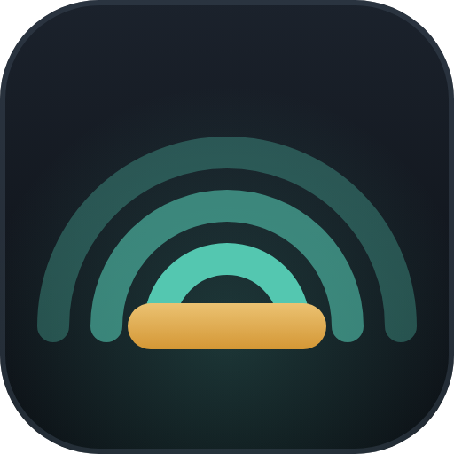

<p align="center"></p>

# sada — on-device Arabic subtitles for YouTube

**sada** (صدى, "echo") renders Arabic subtitles over English YouTube videos.
It translates the video's own captions into Arabic **100% on your device** — a
Manifest V3 Chromium extension with a bundled [transformers.js](https://github.com/huggingface/transformers.js)
NLLB-200 model (`Xenova/nllb-200-distilled-600M`). No account, no cloud translation service.

## The privacy guarantee

The whole point of sada is that **caption text never leaves your machine**.

- The translation model and runtime are downloaded **once, at install time**, by
  `scripts/fetch-assets.mjs` (from Hugging Face and jsDelivr).
- After that, the engine loads locally with `env.allowRemoteModels = false`.
- At **runtime** the only network traffic is YouTube itself — the video and its
  caption cues, fetched same-origin — plus extension-local `chrome-extension://`
  asset loads. Nothing you watch is ever sent to a third-party or a translation
  server. Any runtime request to a non-YouTube, non-extension origin would be a bug.

See `PRIVACY.md` for the plain-language statement.

## Install (developer / load-unpacked)

Requires **Node 18+** and a Chromium browser (Chrome/Edge/Brave).

```bash
# 1. Download the model + library once (~1.8 GB; goes into vendor/ + models/).
node scripts/fetch-assets.mjs
```

Then load it unpacked:

1. Open `chrome://extensions`.
2. Enable **Developer mode** (top-right).
3. Click **Load unpacked** and select this repository's root folder.
4. Open any English YouTube watch page (`youtube.com/watch?v=…`). Arabic
   subtitles appear once the captions are translated. Toggle on/off, resize, and
   enable dual English+Arabic from the toolbar popup.

`fetch-assets.mjs` is idempotent — re-running it only downloads what's missing.

## The dev loop (load-unpacked)

After editing extension source:

1. **Reload the extension**: `chrome://extensions` → the ↻ reload icon on sada's card.
   (Required for changes to `src/sw.js`, `manifest.json`, or the offscreen engine.)
2. **Reload the YouTube tab**: content scripts re-inject on a fresh page load.

For overlay / sync / RTL work you usually don't need the browser at all — open
`test/harness.html` (via `file://` or any static server). It drives the real
`src/overlay.js` and `src/reassemble.js` over a mock player with hand-written
Arabic cues (`test/cues.sample.json`), so you can verify rendering, timeline
sync, dual mode, font size and the status pill with no extension and no model.

## Module map (keep these swappable)

sada is built around three independent seams:

| Module | Files | Job |
|--------|-------|-----|
| **caption-fetch** | `src/yt-hook.js`, `src/caption-fetch.js` | Read the running player's caption track and fetch English cues as `{ start, dur, text }`. Fails gracefully to `no-captions` / `blocked` / `error`. |
| **translate-engine** | `offscreen.html`, `src/offscreen.js`, `src/translate-engine.js` | Turn English strings into Arabic, on-device, in an offscreen document (WebGPU/fp16 NLLB-200, or the built-in Translator API when available — no WASM fallback). |
| **overlay-render** | `src/overlay.js`, `src/overlay.css` | Paint synced, RTL Arabic (optionally dual) over the player; small status pill; survives fullscreen. |

`src/content.js` orchestrates the three; `src/sw.js` owns the single offscreen
document; `popup/` is the on/off + settings surface. Swapping any one seam
(e.g. a different MT model, or a future on-device speech path — see
`docs/whisper-companion.md`) should not touch the other two.

## Packaging

```bash
node scripts/zip.mjs   # -> sada-<version>.zip, excluding dev/docs/listing files
```

See `CHROMEWEBSTORE.md` for store-listing metadata and permission justifications.
